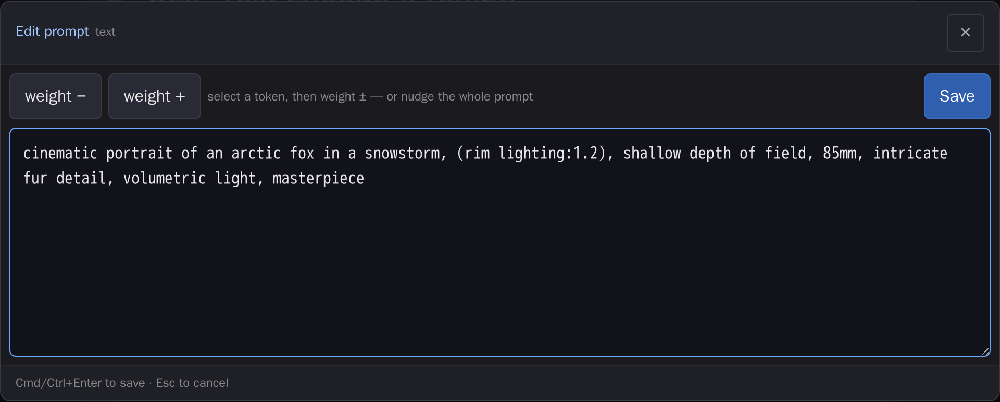

# comfyui-prompt-editor

Full-screen touch editor for multiline prompt widgets: weight steppers, embedding/LoRA insert palette, and a token counter.

> Part of a family of mobile-first ComfyUI usability packs — touch-friendly
> HTML modals that replace clunky native LiteGraph controls, detected by widget
> name, additive and non-clobbering. All share
> [`@laurigates/comfy-modal-kit`](https://github.com/laurigates/comfy-modal-kit)
> (the modal shell, fuzzy primitives, and the cross-pack field-provider registry
> this editor consumes). Siblings:
> [gallery-loader](https://github.com/laurigates/comfyui-gallery-loader),
> [model-gallery](https://github.com/laurigates/comfyui-model-gallery),
> [sampler-info](https://github.com/laurigates/comfyui-sampler-info),
> [touch-numeric](https://github.com/laurigates/comfyui-touch-numeric),
> [touch-connect](https://github.com/laurigates/comfyui-touch-connect),
> [touch-resize](https://github.com/laurigates/comfyui-touch-resize),
> [touch-tooltips](https://github.com/laurigates/comfyui-touch-tooltips).
>
> When a sibling provider pack (e.g. touch-numeric's seed keypad,
> sampler-info's fuzzy sampler list) is installed alongside this editor, the
> all-fields modal mounts that richer inline control per matching widget and
> falls back to its built-in control when none is registered.



*The full-screen editor over any multiline prompt widget: per-token weight
steppers and a roomy textarea, committed back with Cmd/Ctrl+Enter.*

## Install

```sh
cd <ComfyUI>/custom_nodes
git clone https://github.com/laurigates/comfyui-prompt-editor
```

Restart ComfyUI; hard-refresh the browser tab (Ctrl+Shift+R / Cmd+Shift+R).

## What it does

TODO — describe the widgets it enhances and the modal it opens.

## Compatibility

- ComfyUI: modern Vue frontend (`comfyui-frontend-package >= 1.40`) for the
  `widget.onPointerDown` interception hook.
- Frontend changes (JS/CSS) take effect on browser hard-refresh — no restart.

## License

MIT — see `LICENSE`.
